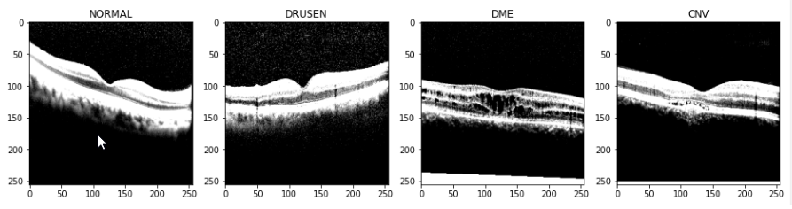
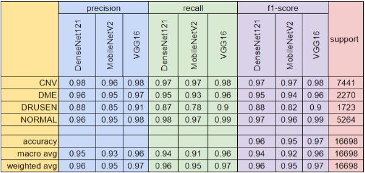
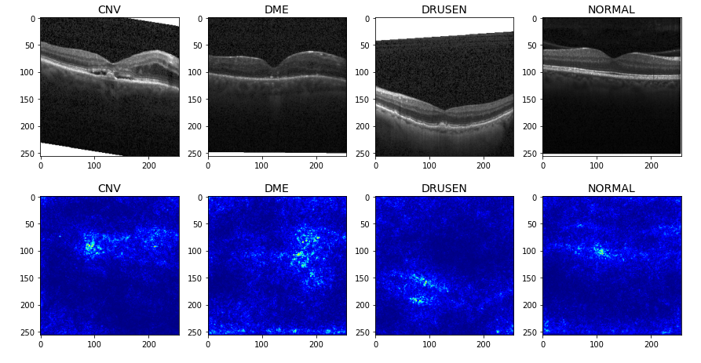
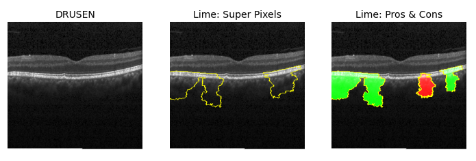

# RetinaAI
## Retina OCT Image Analysis using Computer Vision

Retinal OCT image analysis for eye disease diagnosis: The OCT (Optical Coherence Tomography) is an imaging method used to capture cross sections of the retinas of patients. The captured Retinal OCT images in the dataset made available by Kermany et al at Kaggle are used to diagnose the patient’s retinal health into four categories: Normal, CNV, DME, and DRUSEN.

This project is designed to aid in the detection of retinal diseases (CNV, DME, DRUSEN) and help direct patients to the proper treatment as soon as possible. Using supervised and self-supervised deep learning techniques we wish to  build state-of-the-art Retinal OCT diseases diagnostic system.

## Model Performance

## AI Explainability

### Vanilla Saliency

### LIME Interpretation

